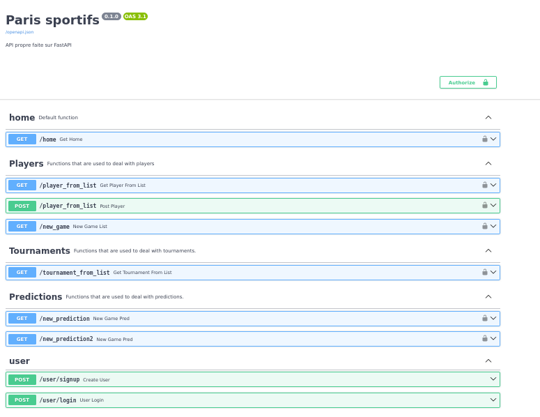
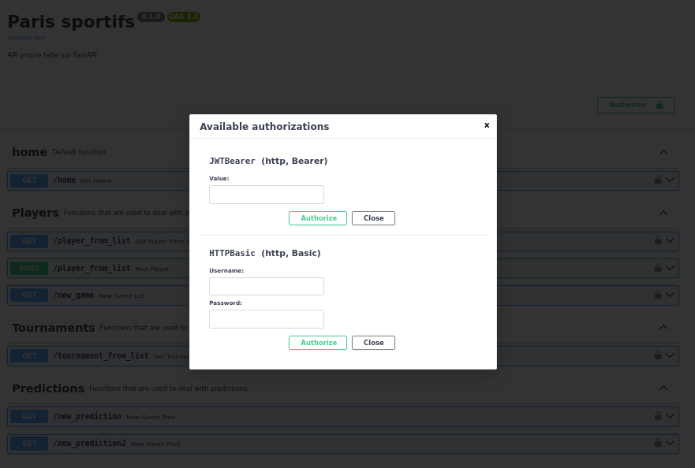

# ATP_MLOps August 2023
  

## Basic Overview

API to predict ATP male tennis matches results. On top of that, databases are available for ATP players and tournaments.

## Requirements
Docker is needed to run the different dockerfiles.

## Key Features
- Detailed DataBases for men tennis players and tournaments.
- Outcome predictions for tennis games based on +10 years tennis matches.
- Token access jetons for users for the main endpoints of the API.
- Databases updates only accessible by administrators.
- Weekly/Monthly updated ML model for constant improved predictions via github actions.

## Installation and quick run
- Clone the github repository.
- Run ...
- Open Browzer at localhost:8000/docs
- Create a new user and connect access the api using the provided token.
  

## Use
The API can be used for different purposes.
- Access some datas (ranking, ELO) of +1000 players.
- Access features of ATP tournaments (dates, surfaces, series...)
- Obtain a prediction of tennis matches with the corresponding odds.
- Restricted access to specific routes to modify players & tournaments databases.

## Structure of the repository

### src

#### app
Contains all the necessary files to run the API.
  
#### Data generation
Contains the files to obtains new datas, preprocessed it before their use to train the model.

#### training
Contains all the files to train the model.

## API Screenshots
- HOME

- NEW USER

- AUTHORIZATION

- PLAYERS DATAS

-API PREDICTION EXAMPLE

## Acknowledgements
- DataScientest for their help, support and supervision of during the development of the project.

## Contacts

### Github
- Rui Da Silva Alfonso: Haeymoss
- Benjamin Roul: Roulitoo
- Julien Biscay: bibi643

