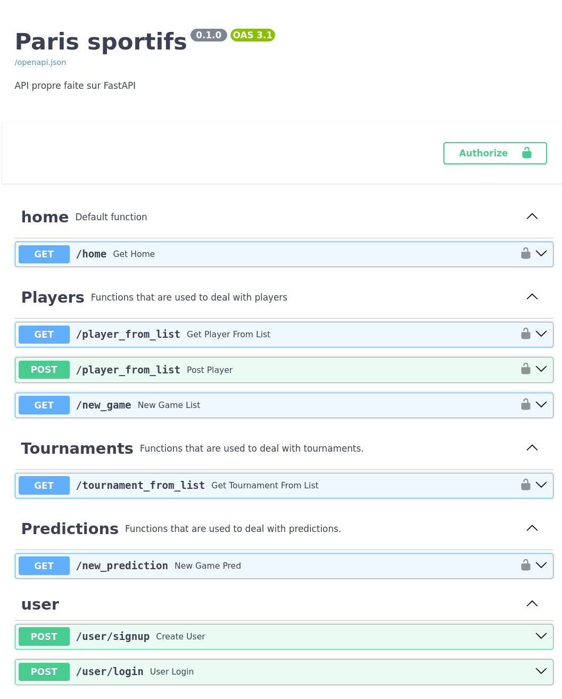
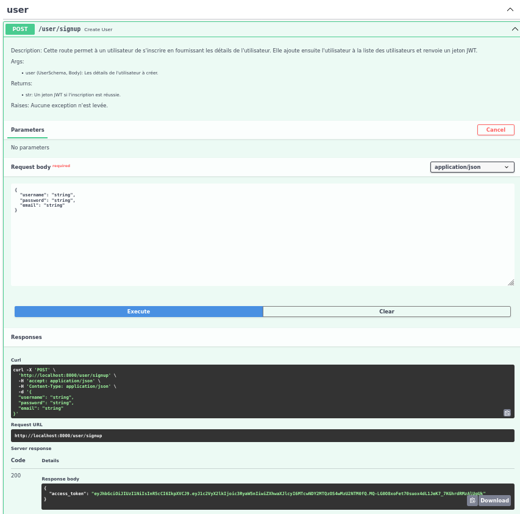
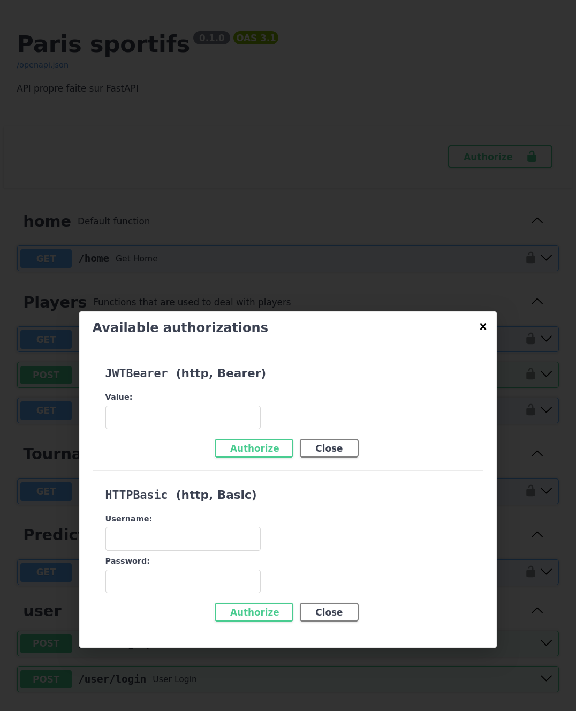
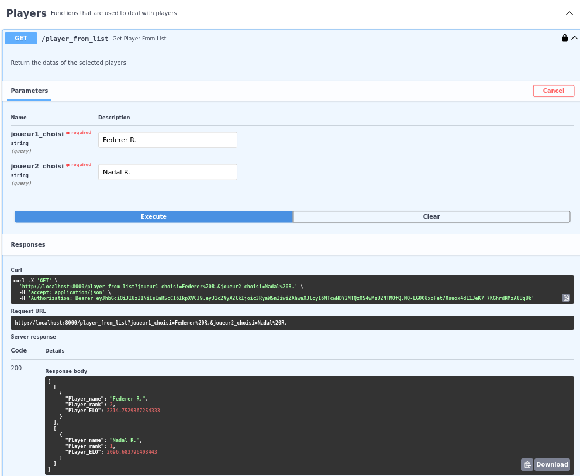
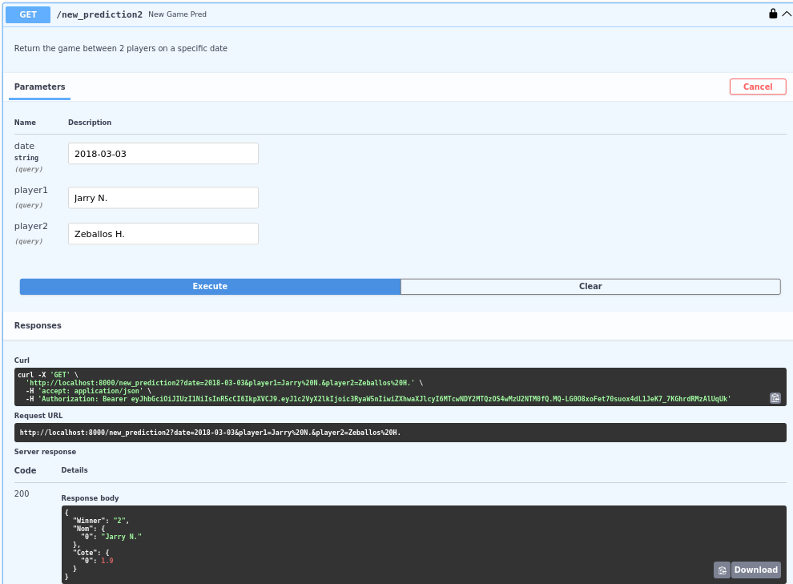

# ATP_MLOps August 2023
  

## Basic Overview

API to  predict ATP male tennis matches results. On top of that, databases are available for ATP players and tournaments.

## Requirements
Docker is needed to run the different dockerfiles.

## Key Features
- Detailed DataBases for men tennis players and tournaments.
- Outcome predictions for tennis games based on +10 years tennis matches.
- Token access jetons for users for the main endpoints of the API.
- Databases updates only accessible by administrators.
- Weekly/Monthly updated ML model for constant improved predictions via github actions.

## Installation and quick run
- Clone the github repository.
- Run : docker-compose-up
- Open Browzer at localhost:8000/docs
- Create a new user and connect access the api using the provided token.

## CI/CD Configuration
- Navigate to your repository settings on GitHub.
- Select the 'Secrets' section and define secrets.HOSTNAME and secrets.AWS_PRIVATE_KEY
- Once the secrets are set, you can monitor the status of the GitHub Actions used to track and maintain the project :
navigate to the 'Actions' tab of your GitHub repository. Here, you can view the status of all ongoing and past actions, including information on when they were triggered and whether they succeeded or failed.

## Use -Endpoints description

### Home 
- /home : Check if the API is working properly sending a welcoming message to the user.

### Players
- GET/player_from_list: Access some datas (ranking, ELO) of +1000 players.
- POST/player_from_list: Accessible only by the admins to update players database.
- GET/new_game: Access to matches between 2 selected players.

### Tournaments
- GET/tournament_from_list: Access features of ATP tournaments (dates, surfaces, series...)

### Predictions

- GET/new_prediction: Obtain a prediction of tennis matches with the corresponding odds.

### User
-  POST/user/signup: Create a new user returning a JWT to login later to access all the main endpoints of the API.

## Structure of the repository

### src

#### app
Contains all the necessary files to run the API.
  
#### Data generation
Contains the files to obtains new datas, preprocessed it before their use to train the model.

#### training
Contains all the files to train the model.

## API Screenshots
- HOME

- NEW USER

- AUTHORIZATION

- PLAYERS DATAS

-API PREDICTION EXAMPLE

## Pending Work
- Monitoring the model performance using updated datas.
- Optimise the structure of the repository.
-
-

## Acknowledgements
- DataScientest for their help, support and supervision of during the development of the project.

## Contacts

### Github
- Rui Da Silva Alfonso: Haeymoss
- Benjamin Roul: Roulitoo
- Julien Biscay: bibi643

